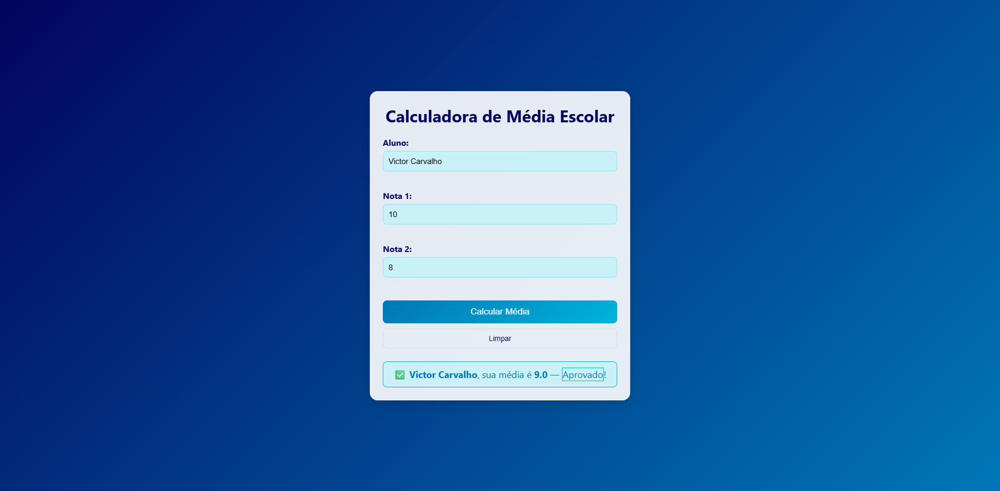

# 🎓 Calculadora de Média Escolar

[](https://github.com/victorcarvalhob/calculadora-media-escolar) [](https://victorcarvalhob.github.io/calculadora-media-escolar/)

> Uma **calculadora de média escolar** simples feita com HTML, CSS e JavaScript — construída como projeto de estudo para praticar manipulação do DOM, validação básica e design responsivo. A simplicidade é proposital; funcionalidades mais avançadas serão adicionadas à medida que eu for evoluindo nos estudos. 🚀

---

## ✨ Visual rápido

<p align="center">
  <a href="https://victorcarvalhob.github.io/calculadora-media-escolar/">
    
  </a>
</p>

> Caso a imagem acima não carregue, acesse a demo online: **[https://victorcarvalhob.github.io/calculadora-media-escolar/](https://victorcarvalhob.github.io/calculadora-media-escolar/)**

---

## 🧭 Links importantes

* Repositório: **[https://github.com/victorcarvalhob/calculadora-media-escolar](https://github.com/victorcarvalhob/calculadora-media-escolar)**
* Demo (GitHub Pages): **[https://victorcarvalhob.github.io/calculadora-media-escolar/](https://victorcarvalhob.github.io/calculadora-media-escolar/)**

---

## 🛠️ Tecnologias

* HTML5
* CSS3 (responsividade + animações simples)
* JavaScript (ES6+)

---

## 🚀 O que este projeto faz hoje

* Recebe **nome** do aluno e **duas notas**.
* Calcula a média simples `(nota1 + nota2) / 2`.
* Exibe a média arredondada para 1 casa decimal e a **situação**:

  * **Aprovado**: média ≥ 7
  * **Reprovado**: média < 7
* Feedback visual com classes CSS (`.aprovado`, `.reprovado`) e transições.
* Layout responsivo para dispositivos móveis.

---

## 🎯 Por que esse projeto? (objetivo de estudo)

* Praticar captura de inputs e manipulação do DOM com JavaScript.
* Aplicar estilos modernos e responsivos com CSS.
* Testar fluxo de desenvolvimento: estrutura do projeto, commits e deploy via GitHub Pages.

---

## 📦 Estrutura do projeto

```
calculadora-media-escolar/
├── index.html      # marcação
├── style.css       # estilos e responsividade
└── script.js       # lógica de cálculo
```

---

## ✅ Roadmap / Melhorias planejadas

Este projeto é um **work-in-progress**. Abaixo estão as melhorias que planejo implementar — sinta-se à vontade para sugerir ou contribuir.

* [ ] Adicionar **mais notas** (não ficar limitado a 2)
* [ ] Transformar `nota1` e `nota2` em um **array dinâmico de notas**
* [ ] **Calcular automaticamente** a média para qualquer quantidade de notas
* [ ] **Salvar histórico de alunos** (localStorage / backend simples)
* [ ] Criar um **array de registros**: `[{ nome, media, situacao }]`
* [ ] Exibir uma **lista de todas as médias calculadas** ao final
* [ ] **Validação de inputs**: impedir campos em branco e notas fora do intervalo válid
* [ ] Exibir **mensagem de alerta** se algum valor estiver incorreto
* [ ] Interatividade extra: **reiniciar formulário** sem recarregar a página
* [ ] UX: **destacar médias altas** com cores diferentes / badges

> As próximas fases incluirão testes unitários rápidos e, possivelmente, integração com um backend leve para persistência.

---

## ⚡ Uso rápido (local)

Clone o repositório e abra `index.html` no navegador:

```bash
# clonar
git clone https://github.com/victorcarvalhob/calculadora-media-escolar.git
cd calculadora-media-escolar
# abrir index.html no navegador (ex: double click ou usar Live Server)
```

---

## 🤝 Como contribuir

Contribuições são bem-vindas — mesmo que seja só uma sugestão de UX ou correção de código.

1. Faça um fork do projeto
2. Crie uma branch para sua feature: `git checkout -b feat/nova-funcionalidade`
3. Faça commits claros e concisos
4. Abra um pull request descrevendo a mudança

Sugestões simples (issues) ou PRs com pequenas melhorias terão revisão rápida.

---

## 🧾 Licença

Este repositório está licenciado sob a [MIT License](LICENSE) — sinta-se livre para estudar, apontar melhorias e reutilizar partes para fins educacionais.

---

## 📬 Contato

**Victor Carvalho** —

* GitHub: [https://github.com/victorcarvalhob](https://github.com/victorcarvalhob)
* Demo: [https://victorcarvalhob.github.io/calculadora-media-escolar/](https://victorcarvalhob.github.io/calculadora-media-escolar/)

---

> *Este projeto foi criado com o objetivo de estudo e evolução contínua. Simplicidade proposital — melhorias a caminho!* 🎯
